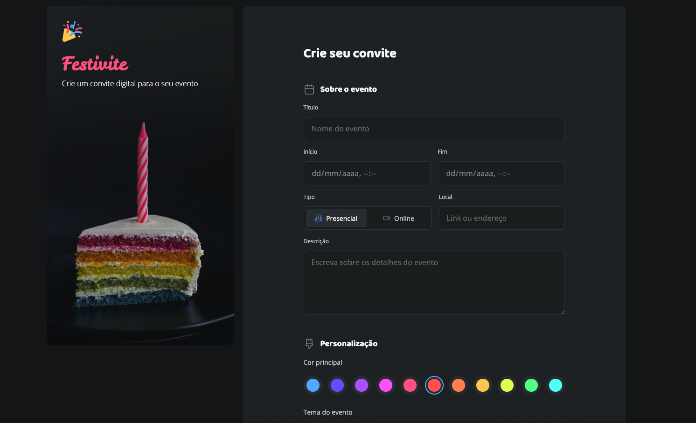

# 🎉 Festivite - Convite Digital para Eventos



## 📋 Descrição

O **Festivite** é uma aplicação web para criação de convites digitais personalizados para qualquer tipo de evento. Com uma interface moderna, intuitiva e responsiva, permite que qualquer pessoa crie, personalize e compartilhe convites de forma rápida e prática.

## ✨ Características

- **Design Responsivo**: Funciona perfeitamente em qualquer dispositivo
- **Personalização Completa**: Escolha cores, temas e imagem de capa
- **Vários Temas de Evento**: Aniversário, Casamento, Formatura, Chá de bebê, Carnaval, Natal, Halloween, entre outros
- **Modo Escuro**: Interface adaptável para ambientes com pouca luz
- **Upload de Imagem**: Adicione uma foto de capa ao seu convite
- **Acessibilidade**: Segue boas práticas para todos os públicos

## 🛠️ Tecnologias Utilizadas

- **HTML5**: Estrutura semântica e acessível
- **CSS3**: Estilização moderna com Flexbox e Grid

## 📁 Estrutura do Projeto

```
projeto-convite/
├── assets/
│   ├── icons/         # Ícones SVG do projeto
│   ├── img/           # Imagens de temas
│   ├── Logo.svg       # Logo do Festivite
│   └── readme.png     # Imagem do README
├── styles/
│   ├── fields/        # Estilos específicos dos campos
│   ├── forms.css      # Estilos do formulário
│   ├── global.css     # Estilos globais
│   ├── index.css      # Arquivo principal de estilos
│   └── layout.css     # Layout responsivo
├── index.html         # Página principal
├── LICENSE            # Licença do projeto
└── README.md          # Este arquivo
```

## 🚀 Como Usar

### Visualização Online

Acesse o projeto em: **[https://rafaelrhp.github.io/projeto-convite/](https://rafaelrhp.github.io/projeto-convite/)**

### Execução Local

1. **Clone o repositório**:

   ```bash
   git clone https://github.com/rafaelrhp/projeto-convite.git
   ```

2. **Navegue até a pasta**:

   ```bash
   cd projeto-convite
   ```

3. **Abra o arquivo index.html**:

   - Dê duplo clique no arquivo `index.html`
   - Ou utilize um servidor local:

     ```bash
     # Com Python
     python -m http.server 3000

     # Com Node.js (se tiver o http-server instalado)
     npx http-server
     ```

## 📝 Funcionalidades do Convite

### Seções do Formulário:

1. **Sobre o Evento**

   - Título, data e horário de início/fim
   - Tipo: Presencial ou Online
   - Local ou link
   - Descrição do evento

2. **Personalização**

   - Cor principal
   - Tema do evento (diversos temas)
   - Upload de foto de capa
   - Modo escuro

3. **Dados para Contato**
   - Nome, e-mail e telefone
   - Aceite dos termos e política de privacidade
   - Opção para receber atualizações por e-mail ou SMS

## 🎨 Design e UX

- **Paleta de Cores**: Diversas opções para personalização
- **Tipografia**: Moderna e legível
- **Layout**: Divisão clara entre preview e formulário
- **Interatividade**: Feedback visual em todos os elementos

## 🔧 Personalização

Para personalizar o projeto:

1. **Cores**: Edite as variáveis CSS em `styles/global.css`
2. **Temas**: Altere ou adicione imagens em `assets/img/`
3. **Ícones**: Substitua os SVGs em `assets/icons/`
4. **Conteúdo**: Atualize textos e opções em `index.html`

## 📄 Licença

Este projeto está sob a licença MIT. Veja o arquivo [LICENSE](LICENSE) para mais detalhes.

## 👨‍💻 Autor

**Rafael RHP**

- GitHub: [@rafaelrhp](https://github.com/rafaelrhp)
- Projeto: [Festivite - Convite Digital](https://rafaelrhp.github.io/projeto-convite/)

---

⭐ **Se este projeto foi útil para você, considere dar uma estrela no repositório!**
